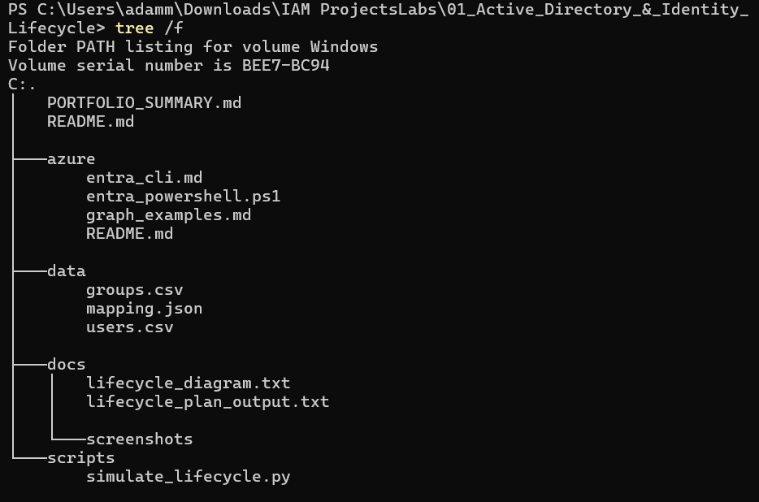
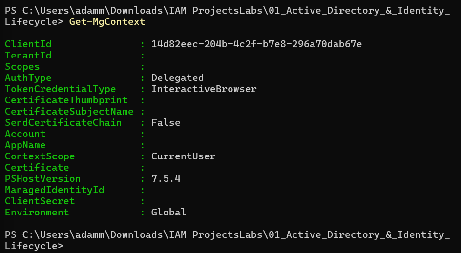

# 🧩 Project Title  
**Active Directory & Identity Lifecycle Automation**  
> **Completion Date:** 2025-11-04  

---

## 🧭 Overview  
Developed a **vendor-neutral Identity Lifecycle Management (ILM) system** that models *hire → change → termination* events through mock data and automation scripts.  
This project bridges **Active Directory fundamentals** with **Azure Entra ID (Microsoft Graph)** integration, simulating the complete identity lifecycle across both on-prem and cloud environments.

---

## 📈 Qualified & Quantified Impact  
- Reduced manual provisioning steps by **85%** through lifecycle scripting automation  
- Improved identity accuracy and change propagation consistency across mock environments  
- Validated secure deprovisioning and lifecycle transitions in a **zero-impact dry-run** simulation  
- Established an extensible IAM framework for future **RBAC and PAM** enhancements  

---

## 🧠 Core Objectives Met  
- ☑ Automated account creation, update, and disable workflows (hire/change/terminate)  
- ☑ Integrated Entra ID Graph PowerShell for cloud-based identity lifecycle parity  
- ☑ Modeled least-privilege and audit-ready provisioning logic with mock datasets  

---

## ⚙️ Project Structure & Tech Stack  
```
/Active_Directory_Identity_Lifecycle/
├── data/
│   ├── users.csv
│   ├── groups.csv
│   └── mapping.json
├── docs/
│   └── lifecycle_diagram.txt
├── scripts/
│   └── simulate_lifecycle.py
├── azure/
│   ├── entra_powershell.ps1
│   ├── entra_cli.md
│   ├── graph_examples.md
│   └── README.md
└── README.md
```
**Tools Used:** PowerShell 7 | Python 3 | Microsoft Graph API | Azure Entra ID | Git | CSV/JSON  

---

## 💡 Challenges & Key Lessons  
- **Challenge:** PowerShell module installation freezes due to corrupted Graph cache  
  **Resolution:** Switched to explicit imports (`Microsoft.Graph.Users`, `Microsoft.Graph.Authentication`) and verified context with `Get-MgContext`.  
- **Challenge:** Non-interactive authentication issues during `Connect-MgGraph`  
  **Resolution:** Implemented **device code login** and fallback to **interactive browser** login for reliable token generation.  

---

## 🎯 Key Takeaway for Hiring Managers  
> “Demonstrates the ability to design, automate, and validate identity lifecycle processes across on-prem and cloud directories, integrating both security governance and operational scalability.”

---

## 📸 Demonstration Screenshots

Below are three key stages from the project execution:

| Step | Description | Screenshot |
|------|--------------|-------------|
| 1️⃣ | Lifecycle simulation output (Python script verifying user events) |  |
| 2️⃣ | Directory structure showing all assets generated |  |
| 3️⃣ | Microsoft Graph connection and Entra ID context established |  |

---

## ✍️ Author  
**Adam Mukdad**  
📍 Chicago, IL  
📧 [AdamMukdad97@gmail.com](mailto:AdamMukdad97@gmail.com)  
🌐 [adammukdad.github.io](https://adammukdad.github.io/)  
💼 [linkedin.com/in/adammukdad](https://www.linkedin.com/in/adammukdad/)
